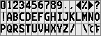

# ImageToLCDFont
A C# program that converts bitmap equal-sized fonts into binary that's suitable for LCDs or OLEDs.

## How To Use The Software

First, you'll need a font image like this:

Make sure that all the characters are with the same height and same width. Otherwise, this application will not work. Note that the separation pixels' numbers should also be the same.

Open the application and drag the image file in. Don't care about if it has the quotation marks on both ends. Hit **Enter** key.

Next up, application will display the image size, and ask you some parameters that is required for conversion.

* Starting pixel: The coordinate to the *top-left corner* pixel of the *top-left corner* character. Note that the coordinates are **zero-based** numbers. If you're not sure, use MSPaint or similar application. MSPaint will display the cursor coordinate in zero-based numbers.

* Character width and height: As the name suggested.

* Separation pixels: Sometimes you'll have pixels that are separating different characters. Enter the amount of separation pixels on both directions.
* Character numbers: The amount of characters you want to extract, on both directions.

With all those entered, the application will try to display the top-left corner character with an ASCII surrounded box. If it doesn't show things normally, please double-check your parameters. Or if you believe it's a bug, please open an **Issue** or figure out how to fix it and commit your changes after checking the code.

And after that, we have 2 modes currently, for output format.
### Output Modes
* Mode 1: Not implemented yet.

* Mode 2: Not implemented yet.

* Mode 3: Split every character into 8-pixels-maximum tall blocks. Read the blocks column by column from left to right, top to bottom; The n-th pixel counted from the top of the column becomes the n-th lowest bit of the output byte of this column.

* Mode 3: Split every character into 8-pixels-maximum tall blocks. Read the blocks column by column from left to right, top to bottom; The n-th pixel counted from the top of the column becomes the n-th highest bit of the output byte of this column.

The application outputs every character in a C-style array without **";"-s**.

Drag mouse over the text and hit Enter and you can have a copy of the output.

## Error Handling

This application has **no** error handing procedures for the **main logic part**. It would either exit or give you an error prompt when encountered exceptions.

The only error handling part is for the **parameter inputing**, and its stability remains unknown. 

**Do not rely on the error handling procedures in the programs when unnecessary.**

## Licensing

The code of this application is licensed under GNU General Public License v3.
